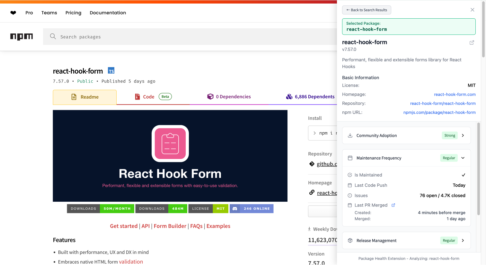

<h2>
  
 Final Project: 

   A System for JavaScript Package Health and Usability Overview 
</h2>

Xinshuo Lei

### Overview

This system helps developers assess the health and usability of JavaScript packages by aggregating data from sources like npm, GitHub, and download statistics. The information is presented as clear, actionable insights through an intuitive Chrome extension interface, and users can also access the raw data directly via the API.

#### Key Features

- **Real-time package analysis**: Instantly view health metrics for any npm package  
- **Integrated data sources**: Aggregates key signals from both npm and GitHub  
- **Multi-dimensional health and usabillity evaluation**: Assesses packages across community adoption, maintenance frequency, release management, implementation footprint, and documentation completeness. Refer to the [Ratings Calculation](/documentations/Ratings_Calculation.md) document for a detailed description of each dimension and how its score is calculated.
- **Browser integration**: Instantly access insights in context, without leaving the page

#### System Demo

**Full feature demo videos**
1. [Quick search via text highlight and keyboard shortcut](https://drive.google.com/file/d/1TlMfa-atrZcUlbYrbe4JJjTO04aCE3K9/view?usp=sharing)
2. [Manual search](https://drive.google.com/file/d/1jIGkkWMrje6W4vvLZ57mp58R_TWgGu6t/view?usp=sharing)
  
### Documentations

- **[Local Setup Guide](documentations/Local_Setup_Guide.md)** - Instructions for running the system locally
- **[Final Presentation Slides (PDF)](documentations/Final_Presentation_Slides.pdf)** - In-class presentation slides that provide a high-level overview of the project’s information story, structure, FAIR assessment, and quality considerations
- **[Information Story](documentations/Information_Story.md)** – Motivations for building the system, the problem it targets, and the information structure needed to effectively solve it
- **[Information Structure](documentations/Information_Structure.md)** – Assessment of existing information structures, necessary transformations, and the resulting structure that meets the requirements outlined in the information story
- **[Accessing the Information Structure](documentations/Information_Structure_Access.md)** – Ways to access the transformed information structure, as supported by the system
- **[Performance and Quality](documentations/Performance_and_Quality.md)** – Desired performance and quality, current state of the system, and remediation plans