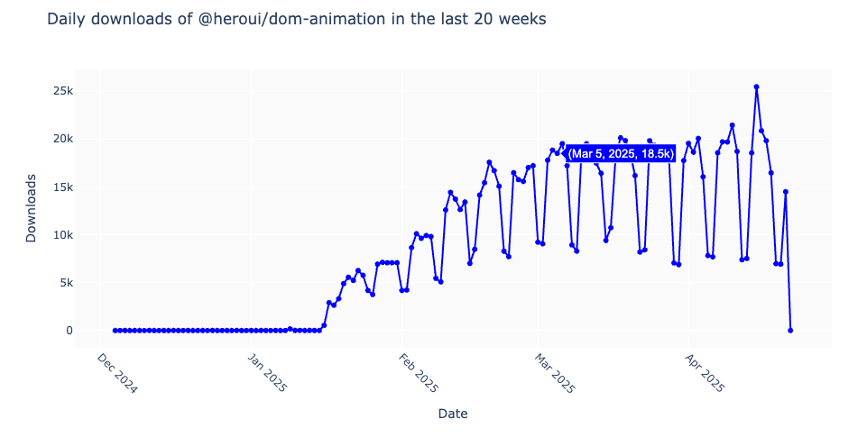

<h2>
  <p> I3 Easy to Use: </p>
  <span> Visualizing Daily Download Trends on npm for a JavaScript Package</span>
</h2>


Xinshuo Lei

### Overview

This project fetches and visualizes per-day download statistics for any JavaScript package on npm, 
providing insights into recent usage trends. These trends can assist developers in making informed decisions about whether to adopt a package based on its recent popularity and activity.

<p align="center">
  
  <br>
  <em>Interactive visualization of download trends</em>
</p>

This visualization flow will later be integrated into a larger system for my final project, which aggregates package information from multiple sources (including npm), extracts key usability and health signals, and delivers them in a compact, in-browser format via a Chrome extension.


### Running the code
**Option 1: Run on Google Colab (Recommended)**
1. Download the notebook: [IMT542_I3.ipynb](https://github.com/xinshuoLei/IMT542/blob/I3/IMT542_I3.ipynb)
2. Go to [Google Colab](https://colab.research.google.com/)
3. Click **"File" → "Upload notebook"**
4. Upload and run the notebook directly in your browser
   
**Option 2: Run Locally**

1. Install Jupyter Notebook by following [the official installation guide](https://jupyter.org/install)
2. Run the notebook with the following command:
   
    ```
    jupyter notebook IMT542_I3.ipynb
    ```


    > The notebook already includes a setup cell that installs all necessary dependencies.  
You don't need to install anything manually. Just run the cells in order.

    
### Usage 

Once the notebook is running, use the following function to generate a visualization of `<package_name>`'s daily downloads over the past `<num_weeks>` weeks:

```python
visualize_daily_downloads_in_past_weeks(package_name, num_weeks)
```

Example (in the last cell of the notebook):

```python
visualize_daily_downloads_in_past_weeks("@heroui/dom-animation", 20)
```

The code above generates the visualization shown in the [Overview](#overview) section, based on daily download data for the package `@heroui/dom-animation`over the past 20 weeks.
 