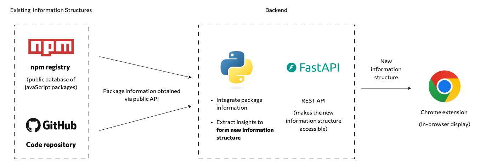
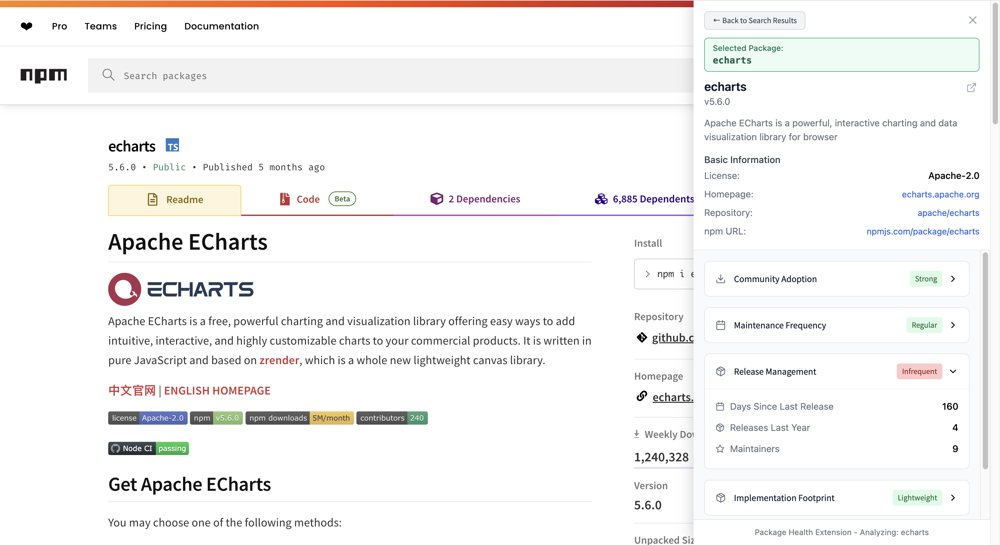

## Accessing the Information Structure

Ways to access the transformed information structure, as supported by the system architecture shown below.

### Table of Contents

- [Access via API](#access-via-api)
- [Access via Chrome Extension](#access-via-chrome-extension)

### Access via API

As shown in the architecture diagram above, the system includes a REST API with endpoints for both raw metrics and computed health and usability scores for JavaScript packages. All endpoints return data in JSON format and follow standard HTTP protocols.

#### Available Endpoints

| Endpoint Path | Description | Example |
|---------------|-------------|---------|
| `/health/?package={package_name}` | Returns comprehensive health and usability data for an npm package | `/health?package=react` |
| `/health/rating-criteria` | Returns rating criteria and thresholds used for calculating package health ratings | `/health/rating-criteria` |
| `/npm/metadata?package={package_name}` | Returns basic metadata about an npm package | `/npm/metadata?package=react` |
| `/npm/downloads?package={package_name}` | Returns download statistics for an npm package | `/npm/downloads?package=react` |
| `/github/repo/{owner}/{repo}` | Returns GitHub repository data like stars, forks, and issues | `/github/repo/facebook/react` |
| `/github/health/{owner}/{repo}` | Returns GitHub community health metrics | `/github/health/facebook/react` |
| `/github/activity/{owner}/{repo}` | Returns GitHub activity and contribution metrics | `/github/activity/facebook/react` |

> Information about all available endpoints is also returned by the root `/` endpoint.

All endpoints are publicly accessible without authentication. The `/health` endpoint is the primary access point for fully assembled package information.

Refer to the [Local Setup Guide](../documentations/Local_Setup_Guide.md) for instructions on setting up and running the API.

### Access via Chrome Extension

The Chrome extension provides a lightweight, in-browser interface for accessing package health and usability data without leaving the current page.

This mode of access is designed to support developers in real time, offering context-aware insights directly within their development workflows.

Refer to the [Local Setup Guide](../documentations/Local_Setup_Guide.md) for setup instructions and usage guidance for the Chrome extension.