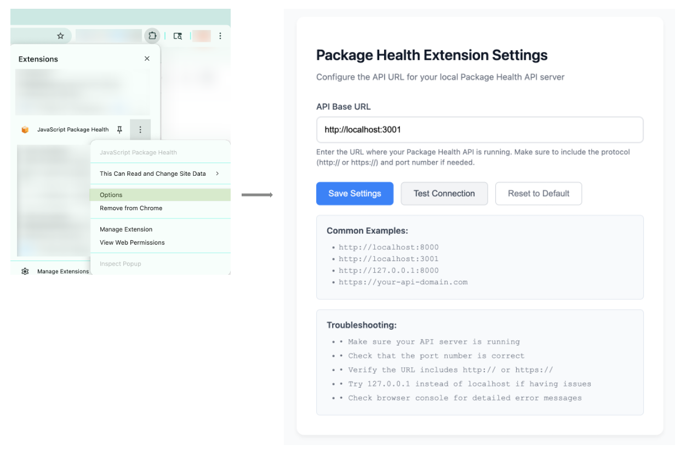
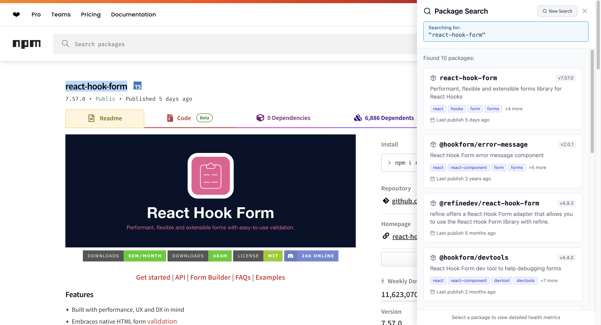

## Local Setup Guide

Instructions for running the system on your local machine.

### Table of Contents

- [Prerequisites](#prerequisites)  
- [Initial Setup](#initial-setup)  
- [Backend Setup (FastAPI)](#backend-setup-fastapi)  
- [Chrome Extension Setup](#chrome-extension-setup)  
- [Configuration](#configuration)  
- [Using the Chrome Extension](#using-the-chrome-extension)  


### Prerequisites

- **Python 3.8+** (for the backend API)  
- **Node.js 16+** and **npm** (for building the Chrome extension)  
  - Installation guide: [Downloading and installing Node.js and npm](https://docs.npmjs.com/downloading-and-installing-node-js-and-npm)  
- **Google Chrome**
- **GitHub Personal Access Token** (required for GitHub API access)  

### Initial Setup

#### 1. Clone the repository

Clone the `Final-Project` branch, which contains the complete system:

```bash
git clone -b Final-Project https://github.com/xinshuoLei/IMT542.git
```

#### 2. Navigate to the project directory

```bash
cd IMT542
```

### Backend Setup (FastAPI)

#### 1. Navigate to the backend directory

```bash
cd fast_api
```

#### 2. Create a Python virtual environment

```bash
python -m venv venv
```

#### 3. Activate the Python virtual environment

```bash
# On Windows
venv\Scripts\activate

# On macOS/Linux
source venv/bin/activate
```

> **Verify activation:** The virtual environment is active when you see `(venv)` at the beginning of your command prompt.

#### 4. Install dependencies

```bash
pip install -r requirements.txt
```

#### 5. Configure environment variables

Create a `.env` file in the `fast_api` directory to enable GitHub API access:

```bash
# .env file
# Replace <your_github_personal_access_token> with your actual token
GITHUB_TOKEN=<your_github_personal_access_token>
```

See [GitHub's official guide](https://docs.github.com/en/authentication/keeping-your-account-and-data-secure/managing-your-personal-access-tokens#creating-a-fine-grained-personal-access-token) for instructions on creating a personal access token.

> A fine-grained token is recommended for this system to improve security and allow more precise permission control.

#### 6. Start the API server

```bash
uvicorn app:app --host 0.0.0.0 --port 8000
```

> Running on port 8000 is optional. If you use a different port or host, remember to update the API URL in the [extension's options page](#configure-api-url-if-needed).

If you used the default command above (with no changes to host or port), the API will be available at: `http://localhost:8000`

**Verify the API is running:**

- Open `http://localhost:8000` in your browser  
- You should see a welcome message and a list of available endpoints  

### Chrome Extension Setup

#### 1. Navigate to the extension directory

```bash
# From the repository root directory
cd chrome_extension
```

#### 2. Install dependencies

```bash
npm install
```

#### 3. Build the extension

```bash
npm run build
```

This creates a `dist` folder with the compiled extension files.

#### 4. Load the extension in Chrome

<ol type="i">
  <li><strong>Open Chrome and navigate to the Extensions page:</strong>
    <ul>
      <li>Type <code>chrome://extensions/</code> in the address bar, or</li>
      <li>Go to Chrome menu → More tools → Extensions</li>
    </ul>
  </li>
  <li><strong>Enable Developer Mode:</strong>
    <ul>
      <li>Toggle the "Developer mode" switch in the top-right corner</li>
    </ul>
  </li>
  <li><strong>Load the extension:</strong>
    <ul>
      <li>Click "Load unpacked"</li>
      <li>Select the <code>chrome_extension/dist</code> folder</li>
      <li>The extension should now appear in your extensions list</li>
    </ul>
  </li>
  <li><strong>Verify installation:</strong>
    <ul>
      <li>Look for the "JavaScript Package Health" extension</li>
      <li>(Optional) Pin it to the toolbar for quick access</li>
    </ul>
  </li>
</ol>

### Configuration

#### Configure API URL (if needed)

If your API runs on a different port or host:



1. Click the **extensions icon** (puzzle piece in the top-right corner of Chrome) →  Find **JavaScript Package Health** →  Click the **three dots (⋮)** next to it →  Select **Options**
1. On the options page, **eet the API Base URL** (default: `http://localhost:8000`)  
2. **Test the Connection** to verify it works  
3. **Save Settings**  

Common alternative URLs:
- `http://127.0.0.1:8000`  
- `http://localhost:3001`  
- Custom domain: `https://your-api-domain.com`  

---

This marks the completion of the setup process 🎉 

Before using the extension, make sure:

- The backend API is running at `http://localhost:8000` (or your configured URL)
- The Chrome extension is loaded and appears in your extensions list
- The extension is configured with the correct API URL (if using a non-default host or port)

### Using the Chrome Extension

> **Note:** The extension will only open when you're on an active webpage. It will not work on a blank new tab.

Start searching for a package by:



- **Highlighting a package name** on any webpage and pressing `Ctrl+H` (`Cmd+H` on Mac), or  
- **Clicking the extension icon** to open the search interface manually  

From the search results, select a package to view detailed health and usability metrics.


